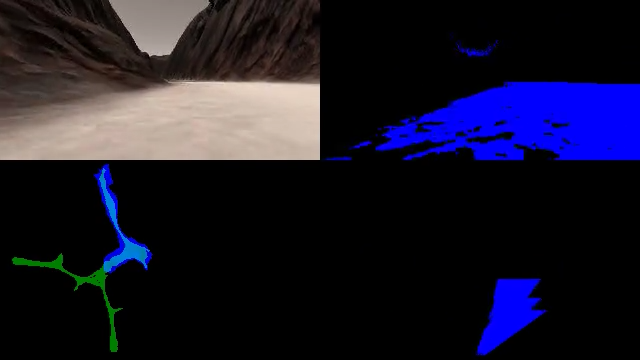
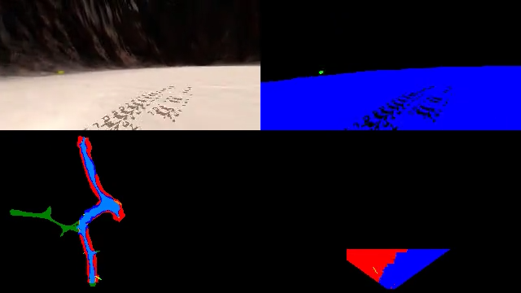

# Sample search and return writeup

## Setup

All the tests and datasets were created using the "Fastest" graphic setting. The code was tested using the [provided Anaconda environment](https://github.com/udacity/RoboND-Python-StarterKit).

## Notebook analysis

Quick test were done on the jupyter notebook before jumping into the simulator. The first step was implementing detection of navigable terrain. The following steps were taken:

* Threshold the camera image, allowing only bright (RGB value greater than 160, 160, 160) pixels to pass.
* Apply a perspective transform.
* Convert the data to rover-centric coordinates (considering the rover at the origin, facing the positive X axis).
* Convert the data to world coordinates and add to the map.

I noticed that the thresholding operation would often see too much navigable terrain when the robot was accelerating or too few when breaking due to changes in pitch. Furthermore, depending on the lightning conditions, some of the sky could be detected as navigable terrain, and navigable terrain far away from the robot could be detected as obstacles.



I decided to keep only the pixels closest to the robot after the perspective transform, by setting other pixels to 0. Initially, I used only the bottom two thirds of the image:

```python
warped = perspect_transform(thresh, source, destination)
warped[0:img.shape[0] // 3, :] = 0
warped[:, :img.shape[1] // 5] = 0
warped[:, -img.shape[1] // 5:] = 0
```

A test with the provided dataset [can be found here](https://www.youtube.com/watch?v=6upkIXDBIvI&list=PLxN-KgeGj8fiu5coK2FuH_vvGjpgjRN1t&index=4) and with a custom, [bigger dataset here](https://www.youtube.com/watch?v=xZgmuXtt2ec&list=PLxN-KgeGj8fiu5coK2FuH_vvGjpgjRN1t&index=5).

All non-navigable terrain was considered as obstacles. A 200x200 auxiliary map was created to save the confidence that a given tile was navigable or obstacle. Every time navigable terrain was seen, some score would be added to that pixel, and obstacles would reduce the score. Pixels with positive scores were considered navigable, and negative scores obstacles. Using scores allowed for the robot to correct wrong detections made from far away.

The robot would much more often mistake navigable terrain as obstacles than the other way around; the weights were chosen to compensate for this (4 for navigable and 1 for obstacles).

The mapping code used on the notebook was:

```python
thresh = color_thresh(img)
output_image[0:img.shape[0], img.shape[1]:, 2] = 255 * thresh
obstacle = perspect_transform(1 - thresh, source, destination)

# Warped image
warped = perspect_transform(thresh, source, destination)
warped[0:2 * img.shape[0] // 3, :] = 0
warped[:, :img.shape[1] // 5] = 0
warped[:, -img.shape[1] // 5:] = 0

obstacle[0:2 * img.shape[0] // 3, :] = 0
obstacle[:, :img.shape[1] // 3] = 0
obstacle[:, -img.shape[1] // 3:] = 0

# Lower right corner
output_image[data.worldmap.shape[0]:, img.shape[1]:, 2] = 255 * warped
output_image[data.worldmap.shape[0]:, img.shape[1]:, 0] = 255 * obstacle

rover_navigable = rover_coords(warped)
world_navigable_x, world_navigable_y = pix_to_world(*rover_navigable, data.xpos[data.count], data.ypos[data.count], data.yaw[data.count], data.worldmap.shape[0], 10)
data.map[world_navigable_y, world_navigable_x] += 4

rover_obstacle = rover_coords(obstacle)
world_obstacle_x, world_obstacle_y = pix_to_world(*rover_obstacle, data.xpos[data.count], data.ypos[data.count], data.yaw[data.count], data.worldmap.shape[0], 10)
data.map[world_obstacle_y, world_obstacle_x] -= 1

data.worldmap[:, :, 2] = np.zeros((200, 200), dtype=int)
data.worldmap[:, :, 2][data.map > 0] = 255
data.worldmap[:, :, 0] = np.zeros((200, 200), dtype=int)
data.worldmap[:, :, 0][data.map < 0] = 255
```

A small program was written to choose threshold values for the rocks. The program loads screenshots containing rocks and shows the detections for a fixed threshold value. [It can be found here](https://github.com/tiagoshibata/RoboND-Rover-Project/blob/master/code/rock_visualizer.py). Appropriate values were chosen and put in the jupyter notebook. I decided to ignore rocks too far away, since the location gets imprecise due to changes in pitch when accelerating. The full `process_image` code is:

```python
def process_image(img):
    if not data.count:
        data.map[:, :] = 0
        data.worldmap[:, :, :] = 0

    output_image = np.zeros((img.shape[0] + data.worldmap.shape[0], img.shape[1]*2, 3))
    # Original image in upper left corner
    output_image[0:img.shape[0], 0:img.shape[1]] = img

    thresh = color_thresh(img)
    obstacle = perspect_transform(1 - thresh, source, destination)

    low = (140, 140, 140)
    high = (5, 70, 70)
    under_thresh = (img[:, :, 0] < low[0]) & (img[:, :, 1] < low[1]) & (img[:, :, 2] < low[2])
    above_thresh = (img[:, :, 0] > high[0]) & (img[:, :, 1] > high[1]) & (img[:, :, 2] > high[2])
    rocks = np.ones_like(img[:, :, 0])
    rocks[under_thresh] = 0
    rocks[above_thresh] = 0

    output_image[0:img.shape[0], img.shape[1]:, 2] = 255 * thresh
    output_image[0:img.shape[0], img.shape[1]:, 1] = 255 * rocks

    # Warped image
    warped = perspect_transform(thresh, source, destination)
    warped[0:2 * img.shape[0] // 3, :] = 0
    warped[:, :img.shape[1] // 5] = 0
    warped[:, -img.shape[1] // 5:] = 0

    obstacle[0:2 * img.shape[0] // 3, :] = 0
    obstacle[:, :img.shape[1] // 3] = 0
    obstacle[:, -img.shape[1] // 3:] = 0

    rocks = perspect_transform(rocks, source, destination)
    rocks[0:img.shape[0] // 2, :] = 0

    # Lower right corner
    output_image[data.worldmap.shape[0]:, img.shape[1]:, 0] = 255 * obstacle
    output_image[data.worldmap.shape[0]:, img.shape[1]:, 1] = 255 * rocks
    output_image[data.worldmap.shape[0]:, img.shape[1]:, 2] = 255 * warped

    rover_navigable = rover_coords(warped)
    world_navigable_x, world_navigable_y = pix_to_world(*rover_navigable, data.xpos[data.count], data.ypos[data.count], data.yaw[data.count], data.worldmap.shape[0], 10)
    data.map[world_navigable_y, world_navigable_x] += 4

    rover_obstacle = rover_coords(obstacle)
    world_obstacle_x, world_obstacle_y = pix_to_world(*rover_obstacle, data.xpos[data.count], data.ypos[data.count], data.yaw[data.count], data.worldmap.shape[0], 10)
    data.map[world_obstacle_y, world_obstacle_x] -= 1

    rover_rocks = rover_coords(rocks)
    world_rocks_x, world_rocks_y = pix_to_world(*rover_rocks, data.xpos[data.count], data.ypos[data.count], data.yaw[data.count], data.worldmap.shape[0], 10)

    data.worldmap[:, :, 2] = np.zeros((200, 200), dtype=int)
    data.worldmap[:, :, 2][data.map > 0] = 255
    data.worldmap[:, :, 0] = np.zeros((200, 200), dtype=int)
    data.worldmap[:, :, 0][data.map < 0] = 255
    data.worldmap[world_rocks_y, world_rocks_x, :] = 255

    # Overlay worldmap with ground truth map
    map_add = cv2.addWeighted(data.worldmap, 1, data.ground_truth, 0.5, 0)
    # Flip map overlay so y-axis points upward and add to output_image
    output_image[img.shape[0]:, 0:data.worldmap.shape[1]] = np.flipud(map_add)

    # Then putting some text over the image
    # cv2.putText(output_image,"Populate this image with your analyses to make a video!", (20, 20),
    #            cv2.FONT_HERSHEY_COMPLEX, 0.4, (255, 255, 255), 1)
    data.count += 1 # Keep track of the index in the Databucket()

    return output_image
```

[A video with mapping and rock detection can be found here.](https://www.youtube.com/watch?v=-GnjOVLRNz4&index=6&list=PLxN-KgeGj8fiu5coK2FuH_vvGjpgjRN1t) The following screenshot shows mapping and rock detection:



## Simulator

Several enhancements were done when testing in the simulator. The final project detects unvisited map areas and uses an A* path finder to explore new areas.

The code was refactored and split into multiple files. The [Vision](https://github.com/tiagoshibata/RoboND-Rover-Project/blob/master/code/vision.py) class is similar to the code used in the notebook, now discarding the top 70% of pixels further away from the robot.

The [NavigationMap](https://github.com/tiagoshibata/RoboND-Rover-Project/blob/master/code/navigation_map.py) class keeps a map with confidence values for each pixel, indicating whether it is a wall or navigable terrain. To detect the undiscovered parts of the map, a gradient morphological transformation was used. The [gradient morphological transformation](http://docs.opencv.org/trunk/d9/d61/tutorial_py_morphological_ops.html) is the difference between the dilation and the erosion of the image, and will create a small area around the border of non-zero pixels.

The gradient transformation was applied on the navigable terrain map, highlighting the borders of the known navigable terrain. Then, it was intersected with areas without obstacles. The result will show pixels that are on the border of known navigable terrain, but haven't been visited by the rover, since it doesn't know whether there is a wall next to it.

The code to detect undiscovered paths is:

```python
def undiscovered_paths(self):
        navigable_border = cv2.morphologyEx(self.navigable.astype(np.uint8), cv2.MORPH_GRADIENT, np.ones((3, 3)))
        undiscovered = navigable_border & np.logical_not(self.navigable) & np.logical_not(self.obstacle)
        return undiscovered
```

Tests were done to validate the vision and mapping. [This video](https://www.youtube.com/watch?v=dEngiKJdF0A&index=2&list=PLxN-KgeGj8fiu5coK2FuH_vvGjpgjRN1t) show in the map the result of the `undiscovered_paths` function in red. A thin red border is visible at areas yet to be visited by the robot.

### Path finding

Multiple tests with the pathfinding algorithm were run. At my first aproach, the robot would call `undiscovered_paths` at each frame, select the undiscovered pixel closest to the robot, and trace a path to it. A* was implemented using euclidean distance as the heuristic function. The decision code was changed to follow the path if the error between the current and target direction is small enough, else stop and rotate.

Since A* is running on a bidimentional grid, the angle between the current robot position and the next pixel advances is large discrete steps (there are only 8 possible directions: up, left, down, right, and 4 diagonals). To smooth out the path, a pixel a few steps further was taken instead of the next step:

```python
def follow_path(Rover, path):
    global aligning
    global target_yaw
    target = path[:5][-1]  # Read up to 4 steps in advance
    dy, dx = target[0] - Rover.pos[1], target[1] - Rover.pos[0]
    target_yaw = 180 / pi * atan2(dy, dx)

    Rover.throttle_set = 0.6
    forward(Rover)
    diff = angle_diff(target_yaw, Rover.yaw)
    print('yaw = {}, target = {}, diff = {}'.format(Rover.yaw, target_yaw, diff))
    if abs(diff) > 50:
        print('Rover not following path - forcing alignment')
        aligning = True
        rotate_to_angle(Rover, target_yaw)
    else:
        print('follow_wall')
        follow_wall(Rover, target_yaw)
```

`follow_wall` was changed to use a weighted sum between `Rover.nav_angles` and the path error:

```python
Rover.steer = np.clip((np.mean(Rover.nav_angles) / 4 + angle_diff(target_yaw, Rover.yaw) / 10) * 180 / np.pi, -15, 15)
```

[A video of the result can be seen here](https://www.youtube.com/watch?v=yiwF62muzCk&index=3&list=PLxN-KgeGj8fiu5coK2FuH_vvGjpgjRN1t).

In this initial approach, the robot keeps bouncing right and left when the camera view is not perfectly symmetric. Furthermore, when put into a completly new area, it would often rotate to face an undiscovered pixel, update its map, and then realize another undiscovered pixel in another direction and rotate to face the new area. This process would make the robot spin 2 or 3 times before deciding to move forward.

The robot would also trace paths very close to walls and sometimes get stuck.

To avoid these issues, many improvements were done to pathfinding:

First, the angle to the pixel was taken into consideration instead of choosing the closest pixel to trace a path. This way, if two pixels have similar distances, the robot would trace a path to the one in front of it instead of spinning.

My goal to make the robot move forward when many undiscovered areas existed close to it, or move to the closest undiscovered area if it had finished mapping its region. Using a weighted sum between the distance and the angle error didn't yield good results; changing the weights would make the robot out-value the angle, or move forward even when an undiscovered area existed right behind it. The code to choose the goals was changed to sort the goals with a weighted sum of the angle error and the **squared** value of the distance.

```python
def path_to_undiscovered(rover):
    rover_x, rover_y = round(rover.pos[0]), round(rover.pos[1])
    rover_yx = (rover_y, rover_x)
    navigation_map = rover.navigation_map

    def goal_score(goal):
        # Sort with closest goals last
        dy, dx = goal[0] - rover.pos[1], goal[1] - rover.pos[0]
        return -(a_star.distance(rover_yx, goal) ** 2) - abs(angle_diff(rover.yaw, 180 / pi * atan2(dy, dx)))

    y_goal, x_goal = navigation_map.undiscovered_paths().nonzero()
    goals = list(sorted(
        zip(y_goal, x_goal),
        key=goal_score,
    ))
    if len(goals) and goals[-1] == rover_yx:
        goals.pop()  # if the current rover position is among the goals, ignore it
    while len(goals):
        tentative = goals[-1]
        path = a_star.run(rover_yx, goals.pop(), navigation_map.navigable)
        if path:
            return path
        print('PATH {}x{} failed'.format(tentative[0], tentative[1]))
```

The A* implementation was changed to add cost to pixels whose neighbors were walls, or whose neighbors' neighbors were walls:

```python
def distance(a, b):
    return sqrt((a[0] - b[0]) ** 2 + (a[1] - b[1]) ** 2)


def heuristic(position, goal, navigation_map):
    h = distance(position, goal)
    adj = adjacency(position, navigation_map)
    h += 9 * (8 - len(adj))
    for n in adj:
        h += (8 - len(adjacency(n, navigation_map)))
    return h


def is_navigable(y, x, navigation_map):
    return x >= 0 and y >= 0 and x < 200 and y < 200 and navigation_map[y, x]


def adjacency(pos, navigation_map):
    adjacent = []
    for i in range(-1, 2):
        y = pos[0] + i
        for j in range(-1, 2):
            x = pos[1] + j
            if (i or j) and is_navigable(y, x, navigation_map):
                adjacent.append((y, x))
    return adjacent
```

A simple unstuck procedure was added. If the rover speed was less than 0.2 for more than 20 frames, it assumed the rover got stuck and rotated for 20 frames, then applied full throttle backwards for 60 frames.

```python
if (stuck >= 20 or Rover.throttle) and abs(Rover.vel) < 0.2:
    stuck += 1
    if stuck > 100:
        stuck = 0
    elif stuck > 40:
        print('Rover stuck - throttle')
        Rover.throttle = -1
        Rover.brake = 0
        Rover.steer = 0
        return Rover
    elif stuck > 20:
        print('Rover stuck')
        Rover.throttle = 0
        if Rover.vel > 0.2:
            Rover.brake = 1
        else:
            Rover.brake = 0
            Rover.steer = Rover.steer > 0 and 15 or -15
        return Rover
    else:
    stuck = 0
```

The A* pathfinding became a CPU bottleneck when the path was too large (when the robot was done exploring a large area). To avoid large FPS drops, which made the robot unresponsive, the decision step was changed not to run path finding for a few frames according to the length of the returned path:

```python
frames_to_path_trace -= 1
if frames_to_path_trace <= 0:
    path = []
    if not going_home:
        path = path_to_undiscovered(Rover)
    if not path:
        start = (round(Rover.start_pos[1]), round(Rover.start_pos[0]))
        rover_yx = (round(Rover.pos[1]), round(Rover.pos[0]))
        path = a_star.run(rover_yx, start, Rover.navigation_map.real_navigable)
    if path:
        follow_path(Rover, path)
        frames_to_path_trace = len(path)
    else:
        frames_to_path_trace = 10
    else:
        follow_wall(Rover, target_yaw is not None and target_yaw or Rover.yaw)
```

In the `decision` function, the rover was programmed to return home if `Rover.samples_to_find - 1` or more rocks were found. To return home, the same A* pathfinding code is used.

### Adjustments and results

Many smaller changes to parameters were done for the rover to achieve a reasonable job. The rock picking code was kept as originally provided, meaning the rover moves toward the rocks it sees along the way. If it fails to pickup a rock, it won't retry it later.

Two full runs were recorded. [This run shows mapping of 99.4% at 79.5% fidelity.](https://www.youtube.com/watch?v=RZT3vV8mPKs&index=7&list=PLxN-KgeGj8fiu5coK2FuH_vvGjpgjRN1t) The runs passes the project requirements of 40% mapping with 60% fidelity, even though the rover got permanently stuck close to the end of the run. Some of the project's limitations can be seen in the video:

* The rover drives past a sample and never returns to collect it. Since the robot knows its location (it has mapped the sample), it could use the map to trace a path to the sample at the end.
* The unstuck code is very limited; it could use more information about the environment and the constructed map to try another path to the sample. The robot would have picked one more sample and returned home if it didn't get stuck.

[A second run was recorded. This time, the robot mapped 81.2% of the terrain with 80.5% fidelity.](https://www.youtube.com/watch?v=J2VlZCN8xxM&index=8&list=PLxN-KgeGj8fiu5coK2FuH_vvGjpgjRN1t) The robot found 5 rock samples, returned home and stopped. Since it found many rock samples before mapping the whole map, it returned home earlier, resulting in a large unexplored area (about 19% of the map).

Since the project passes the minimum requirements and implements all the optional features, I did not optimize it further.

### Possible improvements

The current code is capable of mapping, collecting all samples and returning home, but it does not do it reliably and requires some luck, since it might get stuck or ignore some samples. Some of the improvements I would try if I were to continue the project are:

* **Using the map to trace paths to samples:** The map can be used to move to samples. This would avoid the problem of not collecting samples that have been mapped. The following screenshot, for example, shows a successful run, where the rover collected 5 samples and returned home; however, one samples was seen and mapped, but the rover drove past it and left it behind.

* **Run A* on a separate thread:** Running A* on a separate thread could run the algorithm while keeping the robot responsive.
* **Smarter unstuck method:** When stuck, the robot could use its map to calculate the direction with the least walls and move towards it. This method would be much more reliable than spinning randomly.
* **Resetting the map if all samples haven't been found:** A possible solution to have an implementation that reliably recovers all samples would be resetting the map it the whole environment has been mapped and some samples haven't been found. This would for the robot to remap the whole environment. If some sample is very well hidden, it would keep remapping until it finds it.
* **Fine-tune the mapped area x fidelity trade-off:** There is a clear trade-off between mapped area and fidelity, which can be adjusted by changing the mapping process or adjusting its weights. My final submission achieves a high mapped area at decent fidelity (~80%), but during my tests a high fidelity (>90%) could be achieved at the cost of mapped area.
* **Keep mapping until no unmapped terrain is left:** The return-to-home condition could be changed slightly to keep mapping while unmapped terrain is detected. This would avoid returning home if many samples were found, but a large area was left unexplored.

## Conclusion

This writeup shows the most interesting parts of the project, it's challenges and my solution. It didn't go through every line of my implementation. [The full implementation can be found at this link.]().

Performance of the rover may vary, mostly when running the path finding code with large paths. Using a recent CPU is advisable to keep a good number of rover responses per second.
